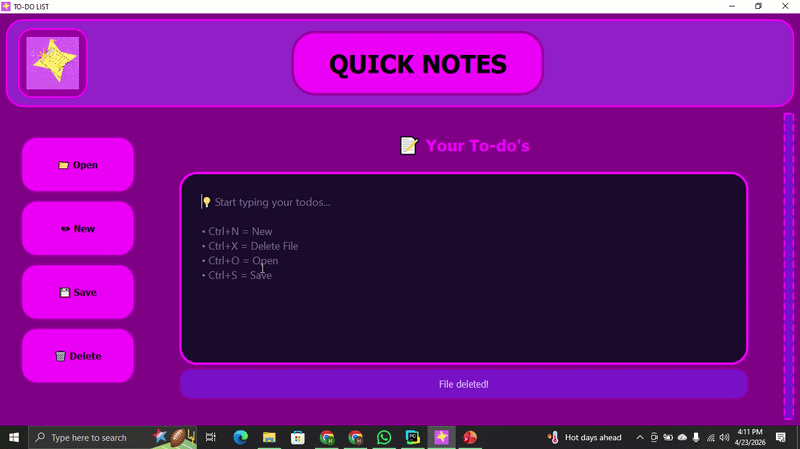
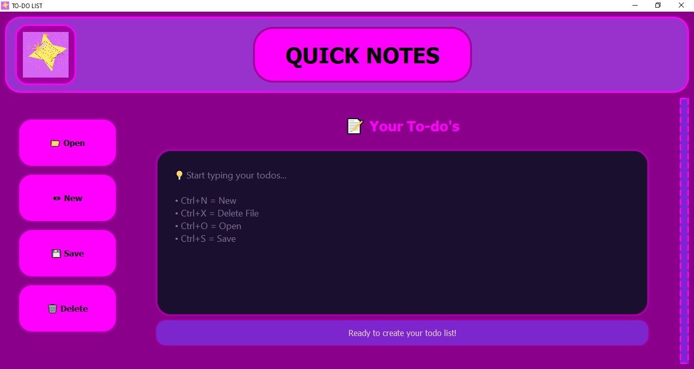
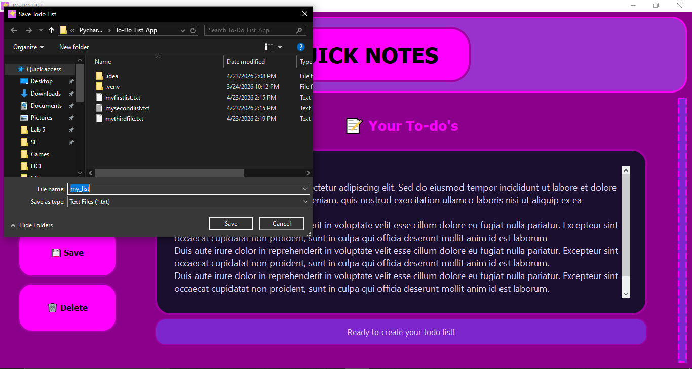
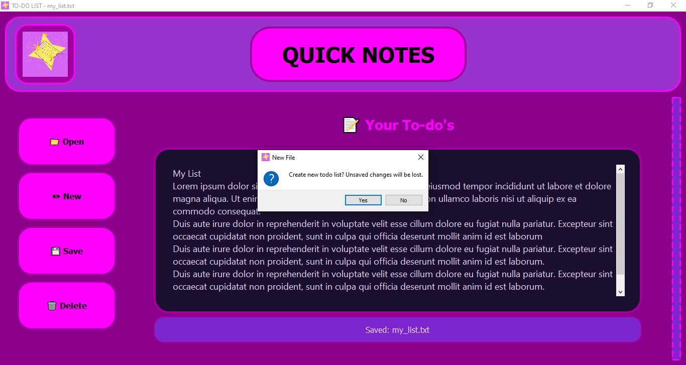
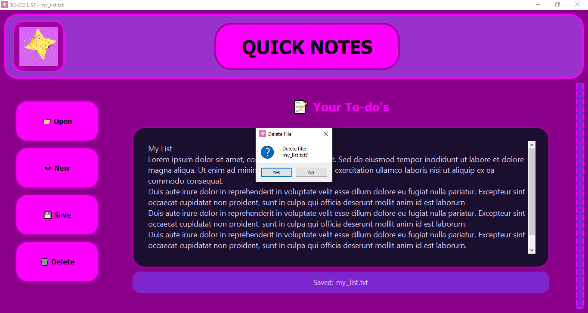

# 📝 Quick Notes – To-Do List App

A desktop-based To-Do List application built using Python and PyQt5, designed with a modern neon-inspired user interface. This project focuses on simplicity, usability, and a visually appealing design for everyday task management. This app also utilises keyboard shortcuts.

## 🎬 Demo

## ✨ Features
➕ Create new to-do lists
📂 Open existing saved lists
💾 Save your progress to a file
🗑️ Delete lists easily
⌨️ Keyboard shortcuts for faster workflow
🎨 Neon-themed custom UI design
📊 Real-time status updates for user actions

## 🎯 Keyboard Shortcuts
1. Ctrl + N → Create New List
2. Ctrl + O → Open List
3. Ctrl + S → Save List
4. Ctrl + X → Delete List
   
## Screenshots
### Main Interface

### Save List

### New List

### Delete List

## 🛠️ Tech Stack
Python 🐍
PyQt5 🎨

## Qt Designer (UI Framework concepts)

## 🚀 Getting Started
1. Clone the repository
git clone https://github.com/your-username/quick-notes.git
cd quick-notes

3. Install dependencies
pip install PyQt5
4. Run the application
python main.py

## 💡 Purpose of the Project
This project was created to improve my skills in:
1. GUI application development using PyQt5
2. Event handling and file management in Python
3. UI/UX design with custom styling
4. Building real-world desktop applications

## 📌 Future Improvements
1. Task categories / priorities
2. Dark/light theme toggle
3. Drag & drop task organization

## 👨‍💻 Author
Built by Hamna Mahmood
Feel free to connect and give feedback!
Email: hamnamahmood004@gmail.com
Linkedin: www.linkedin.com/in/hamnamahmood
